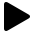
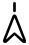
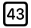

| Glyph | Name | Glyph | Name | Glyph | Name | Glyph | Name |
|----|-------|----|-------|----|-------|----|-------|
|  | square.and.arrow.up |  | square.and.arrow.up.fill |  | square.and.arrow.down |  | square.and.arrow.down.fill |  | square.and.arrow.up.on.square |
|  | square.and.arrow.up.on.square.fill |  | square.and.arrow.down.on.square |  | square.and.arrow.down.on.square.fill |  | pencil |
|  | pencil.circle |  | pencil.circle.fill |  | pencil.slash |  | square.and.pencil |
|  | pencil.and.ellipsis.rectangle |  | pencil.and.outline |  | trash |  | trash.fill |
|  | trash.circle |  | trash.circle.fill |  | trash.slash |  | trash.slash.fill |
|  | folder |  | folder.fill |  | folder.circle |  | folder.circle.fill |
|  | folder.badge.plus |  | folder.fill.badge.plus |  | folder.badge.minus |  | folder.fill.badge.minus |
|  | folder.badge.person.crop |  | folder.fill.badge.person.crop |  | paperplane |  | paperplane.fill |
|  | tray |  | tray.fill |  | tray.and.arrow.up |  | tray.and.arrow.up.fill |
|  | tray.and.arrow.down |  | tray.and.arrow.down.fill |  | tray.2 |  | tray.2.fill |
|  | tray.full |  | tray.full.fill |  | archivebox |  | archivebox.fill |
|  | bin.xmark |  | bin.xmark.fill |  | arrow.up.bin |  | arrow.up.bin.fill |
|  | doc |  | doc.fill |  | doc.circle |  | doc.circle.fill |
|  | arrow.up.doc |  | arrow.up.doc.fill |  | arrow.down.doc |  | arrow.down.doc.fill |
|  | doc.text |  | doc.text.fill |  | doc.on.doc |  | doc.on.doc.fill |
|  | doc.on.clipboard |  | doc.on.clipboard.fill |  | doc.richtext |  | doc.plaintext |
|  | doc.append |  | doc.text.magnifyingglass |  | calendar |  | calendar.circle |
|  | calendar.circle.fill |  | calendar.badge.plus |  | calendar.badge.minus |  | arrowshape.turn.up.left |
|  | arrowshape.turn.up.left.fill |  | arrowshape.turn.up.left.circle |  | arrowshape.turn.up.left.circle.fill |  | arrowshape.turn.up.right |
|  | arrowshape.turn.up.right.fill |  | arrowshape.turn.up.right.circle |  | arrowshape.turn.up.right.circle.fill |  | arrowshape.turn.up.left.2 |
|  | arrowshape.turn.up.left.2.fill |  | book |  | book.fill |  | book.circle |
|  | book.circle.fill |  | bookmark |  | bookmark.fill |  | rosette |
|  | paperclip |  | paperclip.circle |  | paperclip.circle.fill |  | rectangle.and.paperclip |
|  | link |  | link.circle |  | link.circle.fill |  | personalhotspot |
|  | pencil.tip |  | pencil.tip.crop.circle |  | pencil.tip.crop.circle.badge.plus |  | pencil.tip.crop.circle.badge.minus |
|  | person |  | person.fill |  | person.circle |  | person.circle.fill |
|  | person.badge.plus |  | person.badge.plus.fill |  | person.badge.minus |  | person.badge.minus.fill |
|  | person.2 |  | person.2.fill |  | person.3 |  | person.3.fill |
|  | person.crop.circle |  | person.crop.circle.fill |  | person.crop.circle.badge.plus |  | person.crop.circle.fill.badge.plus |
|  | person.crop.circle.badge.minus |  | person.crop.circle.fill.badge.minus |  | person.crop.circle.badge.checkmark |  | person.crop.circle.fill.badge.checkmark |
|  | person.crop.circle.badge.xmark |  | person.crop.circle.fill.badge.xmark |  | person.crop.circle.badge.exclam |  | person.crop.circle.fill.badge.exclam |
|  | person.crop.square |  | person.crop.square.fill |  | command |  | option |
|  | alt |  | delete.right |  | delete.right.fill |  | clear |
|  | clear.fill |  | delete.left |  | delete.left.fill |  | shift |
|  | shift.fill |  | capslock |  | capslock.fill |  | escape |
|  | circle.bottomthird.split |  | power |  | globe |  | sun.min |
|  | sun.min.fill |  | sun.max |  | sun.max.fill |  | sunrise |
|  | sunrise.fill |  | sunset |  | sunset.fill |  | sun.dust |
|  | sun.dust.fill |  | sun.haze |  | sun.haze.fill |  | moon |
|  | moon.fill |  | moon.circle |  | moon.circle.fill |  | zzz |
|  | moon.zzz |  | moon.zzz.fill |  | sparkles |  | moon.stars |
|  | moon.stars.fill |  | cloud |  | cloud.fill |  | cloud.drizzle |
|  | cloud.drizzle.fill |  | cloud.rain |  | cloud.rain.fill |  | cloud.heavyrain |
|  | cloud.heavyrain.fill |  | cloud.fog |  | cloud.fog.fill |  | cloud.hail |
|  | cloud.hail.fill |  | cloud.snow |  | cloud.snow.fill |  | cloud.sleet |
|  | cloud.sleet.fill |  | cloud.bolt |  | cloud.bolt.fill |  | cloud.sun |
|  | cloud.sun.fill |  | cloud.sun.rain |  | cloud.sun.rain.fill |  | cloud.sun.bolt |
|  | cloud.sun.bolt.fill |  | cloud.moon |  | cloud.moon.fill |  | cloud.moon.rain |
|  | cloud.moon.rain.fill |  | cloud.bolt.rain |  | cloud.bolt.rain.fill |  | cloud.moon.bolt |
|  | cloud.moon.bolt.fill |  | smoke |  | smoke.fill |  | wind |
|  | snow |  | wind.snow |  | tornado |  | tropicalstorm |
|  | hurricane |  | thermometer.sun |  | thermometer.snowflake |  | thermometer |
|  | umbrella |  | umbrella.fill |  | flame |  | flame.fill |
|  | light.min |  | light.max |  | rays |  | cursor.rays |
|  | slowmo |  | timelapse |  | keyboard |  | keyboard.chevron.compact.down |
|  | rectangle.3.offgrid |  | rectangle.3.offgrid.fill |  | square.grid.3x2 |  | square.grid.3x2.fill |
|  | rectangle.grid.3x2 |  | rectangle.grid.3x2.fill |  | square.grid.2x2 |  | square.grid.2x2.fill |
|  | rectangle.grid.2x2 |  | rectangle.grid.2x2.fill |  | square.grid.4x3.fill |  | rectangle.grid.1x2 |
|  | rectangle.grid.1x2.fill |  | circle.grid.2x2 |  | circle.grid.2x2.fill |  | circle.grid.3x3 |
|  | circle.grid.3x3.fill |  | circle.grid.hex |  | circle.grid.hex.fill |  | checkmark.seal |
|  | checkmark.seal.fill |  | xmark.seal |  | xmark.seal.fill |  | exclamationmark.triangle |
|  | exclamationmark.triangle.fill |  | drop.triangle |  | drop.triangle.fill |  | play |
|  | play.fill |  | play.circle |  | play.circle.fill |  | play.rectangle |
|  | play.rectangle.fill |  | pause |  | pause.fill |  | pause.circle |
|  | pause.circle.fill |  | pause.rectangle |  | pause.rectangle.fill |  | stop |
|  | stop.fill |  | stop.circle |  | stop.circle.fill |  | playpause |
|  | playpause.fill |  | backward |  | backward.fill |  | forward |
|  | forward.fill |  | backward.end |  | backward.end.fill |  | forward.end |
|  | forward.end.fill |  | backward.end.alt |  | backward.end.alt.fill |  | forward.end.alt |
|  | forward.end.alt.fill |  | eject |  | eject.fill |  | memories |
|  | memories.badge.plus |  | memories.badge.minus |  | shuffle |  | repeat |
|  | repeat.1 |  | speaker |  | speaker.fill |  | speaker.slash |
|  | speaker.slash.fill |  | speaker.zzz |  | speaker.zzz.fill |  | speaker.1 |
|  | speaker.1.fill |  | speaker.2 |  | speaker.2.fill |  | speaker.3 |
|  | speaker.3.fill |  | badge.plus.radiowaves.right |  | music.note |  | music.mic |
|  | music.note.list |  | goforward |  | gobackward |  | goforward.10 |
|  | gobackward.10 |  | goforward.15 |  | gobackward.15 |  | goforward.30 |
|  | gobackward.30 |  | goforward.45 |  | gobackward.45 |  | goforward.60 |
|  | gobackward.60 |  | goforward.75 |  | gobackward.75 |  | goforward.90 |
|  | gobackward.90 |  | goforward.10.ar |  | gobackward.10.ar |  | goforward.15.ar |
|  | gobackward.15.ar |  | goforward.30.ar |  | gobackward.30.ar |  | goforward.45.ar |
|  | gobackward.45.ar |  | goforward.60.ar |  | gobackward.60.ar |  | goforward.75.ar |
|  | gobackward.75.ar |  | goforward.90.ar |  | gobackward.90.ar |  | goforward.10.hi |
|  | gobackward.10.hi |  | goforward.15.hi |  | gobackward.15.hi |  | goforward.30.hi |
|  | gobackward.30.hi |  | goforward.45.hi |  | gobackward.45.hi |  | goforward.60.hi |
|  | gobackward.60.hi |  | goforward.75.hi |  | gobackward.75.hi |  | goforward.90.hi |
|  | gobackward.90.hi |  | goforward.plus |  | gobackward.minus |  | magnifyingglass |
|  | magnifyingglass.circle |  | magnifyingglass.circle.fill |  | plus.magnifyingglass |  | minus.magnifyingglass |
|  | 1.magnifyingglass |  | mic |  | mic.fill |  | mic.circle |
|  | mic.circle.fill |  | mic.slash |  | mic.slash.fill |  | suit.heart |
|  | suit.heart.fill |  | suit.club |  | suit.club.fill |  | suit.spade |
|  | suit.spade.fill |  | suit.diamond |  | suit.diamond.fill |  | heart |
|  | heart.fill |  | heart.circle |  | heart.circle.fill |  | heart.slash |
|  | heart.slash.fill |  | heart.slash.circle |  | heart.slash.circle.fill |  | rhombus |
|  | rhombus.fill |  | star |  | star.fill |  | star.lefthalf.fill |
|  | star.circle |  | star.circle.fill |  | star.slash |  | star.slash.fill |
|  | flag |  | flag.fill |  | flag.circle |  | flag.circle.fill |
|  | flag.slash |  | flag.slash.fill |  | location |  | location.fill |
|  | location.slash |  | location.slash.fill |  | location.north |  | location.north.fill |
|  | location.circle |  | location.circle.fill |  | location.north.line |  | location.north.line.fill |
|  | bell |  | bell.fill |  | bell.circle |  | bell.circle.fill |
|  | bell.slash |  | bell.slash.fill |  | tag |  | tag.fill |
|  | tag.circle |  | tag.circle.fill |  | bolt |  | bolt.fill |
|  | bolt.circle |  | bolt.circle.fill |  | bolt.slash |  | bolt.slash.fill |
|  | bolt.badge.a |  | bolt.badge.a.fill |  | eye |  | eye.fill |
|  | eye.slash |  | eye.slash.fill |  | icloud |  | icloud.fill |
|  | icloud.circle |  | icloud.circle.fill |  | icloud.slash |  | icloud.slash.fill |
|  | exclamationmark.icloud |  | exclamationmark.icloud.fill |  | xmark.icloud |  | xmark.icloud.fill |
|  | link.icloud |  | link.icloud.fill |  | bolt.horizontal.icloud |  | bolt.horizontal.icloud.fill |
|  | person.icloud |  | person.icloud.fill |  | lock.icloud |  | lock.icloud.fill |
|  | arrow.clockwise.icloud |  | arrow.clockwise.icloud.fill |  | arrow.counterclockwise.icloud |  | arrow.counterclockwise.icloud.fill |
|  | icloud.and.arrow.down |  | icloud.and.arrow.down.fill |  | icloud.and.arrow.up |  | icloud.and.arrow.up.fill |
|  | ant |  | ant.fill |  | ant.circle |  | ant.circle.fill |
|  | flashlight.off.fill |  | flashlight.on.fill |  | camera |  | camera.fill |
|  | camera.circle |  | camera.circle.fill |  | camera.rotate |  | camera.rotate.fill |
|  | camera.on.rectangle |  | camera.on.rectangle.fill |  | message |  | message.fill |
|  | message.circle |  | message.circle.fill |  | bubble.right |  | bubble.right.fill |
|  | bubble.left |  | bubble.left.fill |  | exclamationmark.bubble |  | exclamationmark.bubble.fill |
|  | quote.bubble |  | quote.bubble.fill |  | t.bubble |  | t.bubble.fill |
|  | text.bubble |  | text.bubble.fill |  | captions.bubble |  | captions.bubble.fill |
|  | plus.bubble |  | plus.bubble.fill |  | ellipses.bubble |  | ellipses.bubble.fill |
|  | bubble.middle.bottom |  | bubble.middle.bottom.fill |  | bubble.middle.top |  | bubble.middle.top.fill |
|  | bubble.left.and.bubble.right |  | bubble.left.and.bubble.right.fill |  | phone |  | phone.fill |
|  | phone.circle |  | phone.circle.fill |  | phone.badge.plus |  | phone.fill.badge.plus |
|  | phone.arrow.up.right |  | phone.fill.arrow.up.right |  | phone.arrow.down.left |  | phone.fill.arrow.down.left |
|  | phone.arrow.right |  | phone.fill.arrow.right |  | phone.down |  | phone.down.fill |
|  | phone.down.circle |  | phone.down.circle.fill |  | teletype |  | teletype.answer |
|  | video |  | video.fill |  | video.circle |  | video.circle.fill |
|  | video.slash |  | video.slash.fill |  | video.badge.plus |  | video.badge.plus.fill |
|  | arrow.up.right.video |  | arrow.up.right.video.fill |  | arrow.down.left.video |  | arrow.down.left.video.fill |
|  | questionmark.video |  | questionmark.video.fill |  | envelope |  | envelope.fill |
|  | envelope.circle |  | envelope.circle.fill |  | envelope.open |  | envelope.open.fill |
|  | envelope.badge |  | envelope.badge.fill |  | gear |  | signature |
|  | scissors |  | scissors.badge.ellipsis |  | ellipsis |  | ellipsis.circle |
|  | ellipsis.circle.fill |  | bag |  | bag.fill |  | bag.badge.plus |
|  | bag.fill.badge.plus |  | bag.badge.minus |  | bag.fill.badge.minus |  | cart |
|  | cart.fill |  | cart.badge.plus |  | cart.fill.badge.plus |  | cart.badge.minus |
|  | cart.fill.badge.minus |  | creditcard |  | creditcard.fill |  | wand.and.rays |
|  | wand.and.rays.inverse |  | wand.and.stars |  | wand.and.stars.inverse |  | crop |
|  | crop.rotate |  | dial |  | dial.fill |  | nosign |
|  | gauge |  | gauge.badge.plus |  | gauge.badge.minus |  | speedometer |
|  | metronome |  | hifispeaker |  | hifispeaker.fill |  | tuningfork |
|  | paintbrush |  | paintbrush.fill |  | bandage |  | bandage.fill |
|  | wrench |  | wrench.fill |  | hammer |  | hammer.fill |
|  | eyedropper |  | eyedropper.halffull |  | eyedropper.full |  | printer |
|  | printer.fill |  | briefcase |  | briefcase.fill |  | house |
|  | house.fill |  | music.house |  | music.house.fill |  | lock |
|  | lock.fill |  | lock.circle |  | lock.circle.fill |  | lock.slash |
|  | lock.slash.fill |  | lock.open |  | lock.open.fill |  | lock.rotation |
|  | lock.rotation.open |  | wifi |  | wifi.slash |  | wifi.exclamationmark |
|  | pin |  | pin.fill |  | pin.circle |  | pin.circle.fill |
|  | pin.slash |  | pin.slash.fill |  | mappin |  | mappin.circle |
|  | mappin.circle.fill |  | mappin.slash |  | mappin.and.ellipse |  | map |
|  | map.fill |  | safari |  | safari.fill |  | rotate.left |
|  | rotate.left.fill |  | rotate.right |  | rotate.right.fill |  | selection.pin.in.out |
|  | tv |  | tv.fill |  | tv.circle |  | tv.circle.fill |
|  | tv.music.note |  | tv.music.note.fill |  | desktopcomputer |  | airplayvideo |
|  | airplayaudio |  | dot.radiowaves.left.and.right |  | dot.radiowaves.right |  | radiowaves.left |
|  | radiowaves.right |  | antenna.radiowaves.left.and.right |  | guitars |  | car |
|  | car.fill |  | tram.fill |  | bed.double |  | bed.double.fill |
|  | hare |  | hare.fill |  | tortoise |  | tortoise.fill |
|  | film |  | film.fill |  | sportscourt |  | sportscourt.fill |
|  | smiley |  | smiley.fill |  | qrcode |  | barcode |
|  | viewfinder |  | viewfinder.circle |  | viewfinder.circle.fill |  | barcode.viewfinder |
|  | qrcode.viewfinder |  | camera.viewfinder |  | faceid |  | doc.text.viewfinder |
|  | rectangle |  | rectangle.fill |  | photo |  | photo.fill |
|  | plus.rectangle |  | plus.rectangle.fill |  | minus.rectangle |  | minus.rectangle.fill |
|  | checkmark.rectangle |  | checkmark.rectangle.fill |  | xmark.rectangle |  | xmark.rectangle.fill |
|  | person.crop.rectangle |  | person.crop.rectangle.fill |  | rectangle.badge.checkmark |  | rectangle.fill.badge.checkmark |
|  | rectangle.badge.xmark |  | rectangle.fill.badge.xmark |  | sidebar.left |  | sidebar.right |
|  | macwindow |  | uiwindow.split.2x1 |  | rectangle.dock |  | rectangle.split.3x1 |
|  | rectangle.split.3x1.fill |  | square.split.2x1 |  | square.split.2x1.fill |  | square.split.1x2 |
|  | square.split.1x2.fill |  | square.split.2x2 |  | square.split.2x2.fill |  | dot.square |
|  | dot.square.fill |  | squares.below.rectangle |  | rectangle.split.3x3 |  | rectangle.split.3x3.fill |
|  | table |  | table.fill |  | table.badge.more |  | table.badge.more.fill |
|  | rectangle.on.rectangle |  | rectangle.fill.on.rectangle.fill |  | plus.rectangle.on.rectangle |  | plus.rectangle.fill.on.rectangle.fill |
|  | photo.on.rectangle |  | photo.fill.on.rectangle.fill |  | rectangle.on.rectangle.angled |  | rectangle.fill.on.rectangle.angled.fill |
|  | rectangle.stack |  | rectangle.stack.fill |  | rectangle.stack.badge.plus |  | rectangle.stack.fill.badge.plus |
|  | rectangle.stack.badge.minus |  | rectangle.stack.fill.badge.minus |  | rectangle.stack.badge.person.crop |  | rectangle.stack.fill.badge.person.crop |
|  | rectangle.stack.person.crop |  | rectangle.stack.person.crop.fill |  | person.2.square.stack |  | person.2.square.stack.fill |
|  | square.on.square |  | square.fill.on.square.fill |  | plus.square.on.square |  | plus.square.fill.on.square.fill |
|  | square.on.circle |  | square.fill.on.circle.fill |  | square.stack |  | square.stack.fill |
|  | pano |  | pano.fill |  | square.and.line.vertical.and.square |  | square.fill.and.line.vertical.square.fill |
|  | square.fill.and.line.vertical.and.square |  | square.and.line.vertical.and.square.fill |  | flowchart |  | flowchart.fill |
|  | shield |  | shield.fill |  | shield.slash |  | shield.slash.fill |
|  | lock.shield |  | lock.shield.fill |  | checkmark.shield |  | checkmark.shield.fill |
|  | xmark.shield |  | xmark.shield.fill |  | exclamationmark.shield |  | exclamationmark.shield.fill |
|  | shield.lefthalf.fill |  | slider.horizontal.below.rectangle |  | hexagon |  | hexagon.fill |
|  | cube |  | cube.fill |  | cube.box |  | cube.box.fill |
|  | arkit |  | square.stack.3d.down.right |  | square.stack.3d.down.right.fill |  | square.stack.3d.up |
|  | square.stack.3d.up.fill |  | square.stack.3d.up.slash |  | square.stack.3d.up.slash.fill |  | square.stack.3d.down.dottedline |
|  | livephoto |  | livephoto.slash |  | livephoto.play |  | scope |
|  | helm |  | clock |  | clock.fill |  | alarm |
|  | alarm.fill |  | stopwatch |  | stopwatch.fill |  | timer |
|  | gamecontroller |  | gamecontroller.fill |  | ear |  | hand.raised |
|  | hand.raised.fill |  | hand.raised.slash |  | hand.raised.slash.fill |  | hand.thumbsup |
|  | hand.thumbsup.fill |  | hand.thumbsdown |  | hand.thumbsdown.fill |  | hand.draw |
|  | hand.draw.fill |  | hand.point.left |  | hand.point.left.fill |  | hand.point.right |
|  | hand.point.right.fill |  | rectangle.compress.vertical |  | rectangle.expand.vertical |  | rectangle.and.arrow.up.right.and.arrow.down.left |
|  | rectangle.and.arrow.up.right.and.arrow.down.left.slash |  | chart.bar |  | chart.bar.fill |  | chart.pie |
|  | chart.pie.fill |  | burst |  | burst.fill |  | waveform.path.ecg |
|  | waveform.path |  | waveform.path.badge.plus |  | waveform.path.badge.minus |  | waveform |
|  | waveform.circle |  | waveform.circle.fill |  | staroflife |  | staroflife.fill |
|  | headphones |  | gift |  | gift.fill |  | app |
|  | app.fill |  | plus.app |  | plus.app.fill |  | app.badge |
|  | app.badge.fill |  | app.gift |  | app.gift.fill |  | airplane |
|  | studentdesk |  | hourglass |  | hourglass.bottomhalf.fill |  | hourglass.tophalf.fill |
|  | paragraph |  | purchased |  | purchased.circle |  | purchased.circle.fill |
|  | exclamationmark.octagon |  | exclamationmark.octagon.fill |  | xmark.octagon |  | xmark.octagon.fill |
|  | bolt.horizontal |  | bolt.horizontal.fill |  | bolt.horizontal.circle |  | bolt.horizontal.circle.fill |
|  | perspective |  | aspectratio |  | aspectratio.fill |  | skew |
|  | flip.horizontal |  | flip.horizontal.fill |  | grid |  | grid.circle |
|  | grid.circle.fill |  | burn |  | scribble |  | lasso |
|  | recordingtape |  | eyeglasses |  | battery.100 |  | battery.25 |
|  | battery.0 |  | lightbulb |  | lightbulb.fill |  | lightbulb.slash |
|  | lightbulb.slash.fill |  | list.dash |  | list.bullet |  | list.bullet.indent |
|  | list.number |  | increase.indent |  | decrease.indent |  | decrease.quotelevel |
|  | increase.quotelevel |  | list.bullet.below.rectangle |  | text.badge.plus |  | text.badge.minus |
|  | text.badge.checkmark |  | text.badge.xmark |  | text.badge.star |  | text.insert |
|  | text.append |  | text.quote |  | text.alignleft |  | text.aligncenter |
|  | text.alignright |  | text.justify |  | text.justifyleft |  | text.justifyright |
|  | slider.horizontal.3 |  | line.horizontal.3 |  | line.horizontal.3.decrease |  | line.horizontal.3.decrease.circle |
|  | line.horizontal.3.decrease.circle.fill |  | a |  | textformat.size |  | textformat.alt |
|  | textformat |  | textformat.subscript |  | textformat.superscript |  | bold |
|  | italic |  | underline |  | strikethrough |  | bold.italic.underline |
|  | bold.underline |  | view.2d |  | view.3d |  | text.cursor |
|  | fx |  | f.cursive |  | f.cursive.circle |  | f.cursive.circle.fill |
|  | sum |  | percent |  | function |  | textformat.abc |
|  | textformat.abc.dottedunderline |  | textformat.123 |  | info |  | info.circle |
|  | info.circle.fill |  | textbox |  | at |  | at.badge.plus |
|  | at.badge.minus |  | questionmark |  | questionmark.circle |  | questionmark.circle.fill |
|  | questionmark.square |  | questionmark.square.fill |  | questionmark.diamond |  | questionmark.diamond.fill |
|  | exclamationmark |  | exclamationmark.circle |  | exclamationmark.circle.fill |  | exclamationmark.square |
|  | exclamationmark.square.fill |  | plus |  | plus.circle |  | plus.circle.fill |
|  | plus.square |  | plus.square.fill |  | minus |  | minus.circle |
|  | minus.circle.fill |  | minus.square |  | minus.square.fill |  | plusminus |
|  | plusminus.circle |  | plusminus.circle.fill |  | plus.slash.minus |  | minus.slash.plus |
|  | multiply |  | multiply.circle |  | multiply.circle.fill |  | multiply.square |
|  | multiply.square.fill |  | divide |  | divide.circle |  | divide.circle.fill |
|  | divide.square |  | divide.square.fill |  | equal |  | equal.circle |
|  | equal.circle.fill |  | equal.square |  | equal.square.fill |  | lessthan |
|  | lessthan.circle |  | lessthan.circle.fill |  | lessthan.square |  | lessthan.square.fill |
|  | greaterthan |  | greaterthan.circle |  | greaterthan.circle.fill |  | greaterthan.square |
|  | greaterthan.square.fill |  | chevron.left.slash.chevron.right |  | number |  | number.circle |
|  | number.circle.fill |  | number.square |  | number.square.fill |  | x.squareroot |
|  | xmark |  | xmark.circle |  | xmark.circle.fill |  | xmark.square |
|  | xmark.square.fill |  | checkmark |  | checkmark.circle |  | checkmark.circle.fill |
|  | checkmark.square |  | checkmark.square.fill |  | chevron.up |  | chevron.up.circle |
|  | chevron.up.circle.fill |  | chevron.up.square |  | chevron.up.square.fill |  | chevron.down |
|  | chevron.down.circle |  | chevron.down.circle.fill |  | chevron.down.square |  | chevron.down.square.fill |
|  | chevron.left |  | chevron.left.circle |  | chevron.left.circle.fill |  | chevron.left.square |
|  | chevron.left.square.fill |  | chevron.right |  | chevron.right.circle |  | chevron.right.circle.fill |
|  | chevron.right.square |  | chevron.right.square.fill |  | chevron.left.2 |  | chevron.right.2 |
|  | control |  | projective |  | chevron.up.chevron.down |  | chevron.compact.up |
|  | chevron.compact.down |  | chevron.compact.left |  | chevron.compact.right |  | arrow.up |
|  | arrow.up.circle |  | arrow.up.circle.fill |  | arrow.up.square |  | arrow.up.square.fill |
|  | arrow.down |  | arrow.down.circle |  | arrow.down.circle.fill |  | arrow.down.square |
|  | arrow.down.square.fill |  | arrow.left |  | arrow.left.circle |  | arrow.left.circle.fill |
|  | arrow.left.square |  | arrow.left.square.fill |  | arrow.right |  | arrow.right.circle |
|  | arrow.right.circle.fill |  | arrow.right.square |  | arrow.right.square.fill |  | arrow.up.left |
|  | arrow.up.left.circle |  | arrow.up.left.circle.fill |  | arrow.up.left.square |  | arrow.up.left.square.fill |
|  | arrow.up.right |  | arrow.up.right.circle |  | arrow.up.right.circle.fill |  | arrow.up.right.square |
|  | arrow.up.right.square.fill |  | arrow.down.left |  | arrow.down.left.circle |  | arrow.down.left.circle.fill |
|  | arrow.down.left.square |  | arrow.down.left.square.fill |  | arrow.down.right |  | arrow.down.right.circle |
|  | arrow.down.right.circle.fill |  | arrow.down.right.square |  | arrow.down.right.square.fill |  | arrow.up.arrow.down |
|  | arrow.up.arrow.down.circle |  | arrow.up.arrow.down.circle.fill |  | arrow.up.arrow.down.square |  | arrow.up.arrow.down.square.fill |
|  | arrow.right.arrow.left |  | arrow.right.arrow.left.circle |  | arrow.right.arrow.left.circle.fill |  | arrow.right.arrow.left.square |
|  | arrow.right.arrow.left.square.fill |  | arrow.turn.right.up |  | arrow.turn.right.down |  | arrow.turn.down.left |
|  | arrow.turn.down.right |  | arrow.turn.left.up |  | arrow.turn.left.down |  | arrow.turn.up.left |
|  | arrow.turn.up.right |  | arrow.uturn.up |  | arrow.uturn.up.circle |  | arrow.uturn.up.circle.fill |
|  | arrow.uturn.up.square |  | arrow.uturn.up.square.fill |  | arrow.uturn.down |  | arrow.uturn.down.circle |
|  | arrow.uturn.down.circle.fill |  | arrow.uturn.down.square |  | arrow.uturn.down.square.fill |  | arrow.uturn.left |
|  | arrow.uturn.left.circle |  | arrow.uturn.left.circle.fill |  | arrow.uturn.left.circle.badge.ellipsis |  | arrow.uturn.left.square |
|  | arrow.uturn.left.square.fill |  | arrow.uturn.right |  | arrow.uturn.right.circle |  | arrow.uturn.right.circle.fill |
|  | arrow.uturn.right.square |  | arrow.uturn.right.square.fill |  | arrow.up.and.down |  | arrow.up.and.down.circle |
|  | arrow.up.and.down.circle.fill |  | arrow.up.and.down.square |  | arrow.up.and.down.square.fill |  | arrow.left.and.right |
|  | arrow.left.and.right.circle |  | arrow.left.and.right.circle.fill |  | arrow.left.and.right.square |  | arrow.left.and.right.square.fill |
|  | arrow.up.to.line.alt |  | arrow.up.to.line |  | arrow.down.to.line.alt |  | arrow.down.to.line |
|  | arrow.left.to.line.alt |  | arrow.left.to.line |  | arrow.right.to.line.alt |  | arrow.right.to.line |
|  | return |  | arrow.clockwise |  | arrow.clockwise.circle |  | arrow.clockwise.circle.fill |
|  | arrow.counterclockwise |  | arrow.counterclockwise.circle |  | arrow.counterclockwise.circle.fill |  | arrow.up.left.and.arrow.down.right |
|  | arrow.down.right.and.arrow.up.left |  | arrow.2.squarepath |  | arrow.2.circlepath |  | arrow.2.circlepath.circle |
|  | arrow.2.circlepath.circle.fill |  | arrow.3.trianglepath |  | leaf.arrow.circlepath |  | arrow.up.right.diamond |
|  | arrow.up.right.diamond.fill |  | arrow.merge |  | arrow.swap |  | arrow.branch |
|  | arrowtriangle.up |  | arrowtriangle.up.fill |  | arrowtriangle.up.circle |  | arrowtriangle.up.circle.fill |
|  | arrowtriangle.up.square |  | arrowtriangle.up.square.fill |  | arrowtriangle.down |  | arrowtriangle.down.fill |
|  | arrowtriangle.down.circle |  | arrowtriangle.down.circle.fill |  | arrowtriangle.down.square |  | arrowtriangle.down.square.fill |
|  | arrowtriangle.left |  | arrowtriangle.left.fill |  | arrowtriangle.left.circle |  | arrowtriangle.left.circle.fill |
|  | arrowtriangle.left.square |  | arrowtriangle.left.square.fill |  | arrowtriangle.right |  | arrowtriangle.right.fill |
|  | arrowtriangle.right.circle |  | arrowtriangle.right.circle.fill |  | arrowtriangle.right.square |  | arrowtriangle.right.square.fill |
|  | triangle |  | triangle.fill |  | triangle.lefthalf.fill |  | triangle.righthalf.fill |
|  | capsule |  | capsule.fill |  | circle |  | circle.fill |
|  | circle.lefthalf.fill |  | circle.righthalf.fill |  | largecircle.fill.circle |  | smallcircle.fill.circle |
|  | smallcircle.fill.circle.fill |  | smallcircle.circle |  | smallcircle.circle.fill |  | slash.circle |
|  | slash.circle.fill |  | asterisk.circle |  | asterisk.circle.fill |  | a.circle |
|  | a.circle.fill |  | b.circle |  | b.circle.fill |  | c.circle |
|  | c.circle.fill |  | d.circle |  | d.circle.fill |  | e.circle |
|  | e.circle.fill |  | f.circle |  | f.circle.fill |  | g.circle |
|  | g.circle.fill |  | h.circle |  | h.circle.fill |  | i.circle |
|  | i.circle.fill |  | j.circle |  | j.circle.fill |  | k.circle |
|  | k.circle.fill |  | l.circle |  | l.circle.fill |  | m.circle |
|  | m.circle.fill |  | n.circle |  | n.circle.fill |  | o.circle |
|  | o.circle.fill |  | p.circle |  | p.circle.fill |  | q.circle |
|  | q.circle.fill |  | r.circle |  | r.circle.fill |  | s.circle |
|  | s.circle.fill |  | t.circle |  | t.circle.fill |  | u.circle |
|  | u.circle.fill |  | v.circle |  | v.circle.fill |  | w.circle |
|  | w.circle.fill |  | x.circle |  | x.circle.fill |  | y.circle |
|  | y.circle.fill |  | z.circle |  | z.circle.fill |  | dollarsign.circle |
|  | dollarsign.circle.fill |  | centsign.circle |  | centsign.circle.fill |  | yensign.circle |
|  | yensign.circle.fill |  | sterlingsign.circle |  | sterlingsign.circle.fill |  | francsign.circle |
|  | francsign.circle.fill |  | florinsign.circle |  | florinsign.circle.fill |  | turkishlirasign.circle |
|  | turkishlirasign.circle.fill |  | rublesign.circle |  | rublesign.circle.fill |  | eurosign.circle |
|  | eurosign.circle.fill |  | dongsign.circle |  | dongsign.circle.fill |  | indianrupeesign.circle |
|  | indianrupeesign.circle.fill |  | tengesign.circle |  | tengesign.circle.fill |  | pesetasign.circle |
|  | pesetasign.circle.fill |  | pesosign.circle |  | pesosign.circle.fill |  | kipsign.circle |
|  | kipsign.circle.fill |  | wonsign.circle |  | wonsign.circle.fill |  | lirasign.circle |
|  | lirasign.circle.fill |  | australsign.circle |  | australsign.circle.fill |  | hryvniasign.circle |
|  | hryvniasign.circle.fill |  | nairasign.circle |  | nairasign.circle.fill |  | guaranisign.circle |
|  | guaranisign.circle.fill |  | coloncurrencysign.circle |  | coloncurrencysign.circle.fill |  | cedisign.circle |
|  | cedisign.circle.fill |  | cruzeirosign.circle |  | cruzeirosign.circle.fill |  | tugriksign.circle |
|  | tugriksign.circle.fill |  | millsign.circle |  | millsign.circle.fill |  | sheqelsign.circle |
|  | sheqelsign.circle.fill |  | manatsign.circle |  | manatsign.circle.fill |  | rupeesign.circle |
|  | rupeesign.circle.fill |  | bahtsign.circle |  | bahtsign.circle.fill |  | larisign.circle |
|  | larisign.circle.fill |  | bitcoinsign.circle |  | bitcoinsign.circle.fill |  | 0.circle |
|  | 0.circle.fill |  | 1.circle |  | 1.circle.fill |  | 2.circle |
|  | 2.circle.fill |  | 3.circle |  | 3.circle.fill |  | 4.circle |
|  | 4.circle.fill |  | 4.alt.circle |  | 4.alt.circle.fill |  | 5.circle |
|  | 5.circle.fill |  | 6.circle |  | 6.circle.fill |  | 6.alt.circle |
|  | 6.alt.circle.fill |  | 7.circle |  | 7.circle.fill |  | 8.circle |
|  | 8.circle.fill |  | 9.circle |  | 9.circle.fill |  | 9.alt.circle |
|  | 9.alt.circle.fill |  | 00.circle |  | 00.circle.fill |  | 01.circle |
|  | 01.circle.fill |  | 02.circle |  | 02.circle.fill |  | 03.circle |
|  | 03.circle.fill |  | 04.circle |  | 04.circle.fill |  | 05.circle |
|  | 05.circle.fill |  | 06.circle |  | 06.circle.fill |  | 07.circle |
|  | 07.circle.fill |  | 08.circle |  | 08.circle.fill |  | 09.circle |
|  | 09.circle.fill |  | 10.circle |  | 10.circle.fill |  | 11.circle |
|  | 11.circle.fill |  | 12.circle |  | 12.circle.fill |  | 13.circle |
|  | 13.circle.fill |  | 14.circle |  | 14.circle.fill |  | 15.circle |
|  | 15.circle.fill |  | 16.circle |  | 16.circle.fill |  | 17.circle |
|  | 17.circle.fill |  | 18.circle |  | 18.circle.fill |  | 19.circle |
|  | 19.circle.fill |  | 20.circle |  | 20.circle.fill |  | 21.circle |
|  | 21.circle.fill |  | 22.circle |  | 22.circle.fill |  | 23.circle |
|  | 23.circle.fill |  | 24.circle |  | 24.circle.fill |  | 25.circle |
|  | 25.circle.fill |  | 26.circle |  | 26.circle.fill |  | 27.circle |
|  | 27.circle.fill |  | 28.circle |  | 28.circle.fill |  | 29.circle |
|  | 29.circle.fill |  | 30.circle |  | 30.circle.fill |  | 31.circle |
|  | 31.circle.fill |  | 32.circle |  | 32.circle.fill |  | 33.circle |
|  | 33.circle.fill |  | 34.circle |  | 34.circle.fill |  | 35.circle |
|  | 35.circle.fill |  | 36.circle |  | 36.circle.fill |  | 37.circle |
|  | 37.circle.fill |  | 38.circle |  | 38.circle.fill |  | 39.circle |
|  | 39.circle.fill |  | 40.circle |  | 40.circle.fill |  | 41.circle |
|  | 41.circle.fill |  | 42.circle |  | 42.circle.fill |  | 43.circle |
|  | 43.circle.fill |  | 44.circle |  | 44.circle.fill |  | 45.circle |
|  | 45.circle.fill |  | 46.circle |  | 46.circle.fill |  | 47.circle |
|  | 47.circle.fill |  | 48.circle |  | 48.circle.fill |  | 49.circle |
|  | 49.circle.fill |  | 50.circle |  | 50.circle.fill |  | square |
|  | square.fill |  | square.lefthalf.fill |  | square.righthalf.fill |  | a.square |
|  | a.square.fill |  | b.square |  | b.square.fill |  | c.square |
|  | c.square.fill |  | d.square |  | d.square.fill |  | e.square |
|  | e.square.fill |  | f.square |  | f.square.fill |  | g.square |
|  | g.square.fill |  | h.square |  | h.square.fill |  | i.square |
|  | i.square.fill |  | j.square |  | j.square.fill |  | k.square |
|  | k.square.fill |  | l.square |  | l.square.fill |  | m.square |
|  | m.square.fill |  | n.square |  | n.square.fill |  | o.square |
|  | o.square.fill |  | p.square |  | p.square.fill |  | q.square |
|  | q.square.fill |  | r.square |  | r.square.fill |  | s.square |
|  | s.square.fill |  | t.square |  | t.square.fill |  | u.square |
|  | u.square.fill |  | v.square |  | v.square.fill |  | w.square |
|  | w.square.fill |  | x.square |  | x.square.fill |  | y.square |
|  | y.square.fill |  | z.square |  | z.square.fill |  | dollarsign.square |
|  | dollarsign.square.fill |  | centsign.square |  | centsign.square.fill |  | yensign.square |
|  | yensign.square.fill |  | sterlingsign.square |  | sterlingsign.square.fill |  | francsign.square |
|  | francsign.square.fill |  | florinsign.square |  | florinsign.square.fill |  | turkishlirasign.square |
|  | turkishlirasign.square.fill |  | rublesign.square |  | rublesign.square.fill |  | eurosign.square |
|  | eurosign.square.fill |  | dongsign.square |  | dongsign.square.fill |  | indianrupeesign.square |
|  | indianrupeesign.square.fill |  | tengesign.square |  | tengesign.square.fill |  | pesetasign.square |
|  | pesetasign.square.fill |  | pesosign.square |  | pesosign.square.fill |  | kipsign.square |
|  | kipsign.square.fill |  | wonsign.square |  | wonsign.square.fill |  | lirasign.square |
|  | lirasign.square.fill |  | australsign.square |  | australsign.square.fill |  | hryvniasign.square |
|  | hryvniasign.square.fill |  | nairasign.square |  | nairasign.square.fill |  | guaranisign.square |
|  | guaranisign.square.fill |  | coloncurrencysign.square |  | coloncurrencysign.square.fill |  | cedisign.square |
|  | cedisign.square.fill |  | cruzeirosign.square |  | cruzeirosign.square.fill |  | tugriksign.square |
|  | tugriksign.square.fill |  | millsign.square |  | millsign.square.fill |  | sheqelsign.square |
|  | sheqelsign.square.fill |  | manatsign.square |  | manatsign.square.fill |  | rupeesign.square |
|  | rupeesign.square.fill |  | bahtsign.square |  | bahtsign.square.fill |  | larisign.square |
|  | larisign.square.fill |  | bitcoinsign.square |  | bitcoinsign.square.fill |  | 0.square |
|  | 0.square.fill |  | 1.square |  | 1.square.fill |  | 2.square |
|  | 2.square.fill |  | 3.square |  | 3.square.fill |  | 4.square |
|  | 4.square.fill |  | 4.alt.square |  | 4.alt.square.fill |  | 5.square |
|  | 5.square.fill |  | 6.square |  | 6.square.fill |  | 6.alt.square |
|  | 6.alt.square.fill |  | 7.square |  | 7.square.fill |  | 8.square |
|  | 8.square.fill |  | 9.square |  | 9.square.fill |  | 9.alt.square |
|  | 9.alt.square.fill |  | 00.square |  | 00.square.fill |  | 01.square |
|  | 01.square.fill |  | 02.square |  | 02.square.fill |  | 03.square |
|  | 03.square.fill |  | 04.square |  | 04.square.fill |  | 05.square |
|  | 05.square.fill |  | 06.square |  | 06.square.fill |  | 07.square |
|  | 07.square.fill |  | 08.square |  | 08.square.fill |  | 09.square |
|  | 09.square.fill |  | 10.square |  | 10.square.fill |  | 11.square |
|  | 11.square.fill |  | 12.square |  | 12.square.fill |  | 13.square |
|  | 13.square.fill |  | 14.square |  | 14.square.fill |  | 15.square |
|  | 15.square.fill |  | 16.square |  | 16.square.fill |  | 17.square |
|  | 17.square.fill |  | 18.square |  | 18.square.fill |  | 19.square |
|  | 19.square.fill |  | 20.square |  | 20.square.fill |  | 21.square |
|  | 21.square.fill |  | 22.square |  | 22.square.fill |  | 23.square |
|  | 23.square.fill |  | 24.square |  | 24.square.fill |  | 25.square |
|  | 25.square.fill |  | 26.square |  | 26.square.fill |  | 27.square |
|  | 27.square.fill |  | 28.square |  | 28.square.fill |  | 29.square |
|  | 29.square.fill |  | 30.square |  | 30.square.fill |  | 31.square |
|  | 31.square.fill |  | 32.square |  | 32.square.fill |  | 33.square |
|  | 33.square.fill |  | 34.square |  | 34.square.fill |  | 35.square |
|  | 35.square.fill |  | 36.square |  | 36.square.fill |  | 37.square |
|  | 37.square.fill |  | 38.square |  | 38.square.fill |  | 39.square |
|  | 39.square.fill |  | 40.square |  | 40.square.fill |  | 41.square |
|  | 41.square.fill |  | 42.square |  | 42.square.fill |  | 43.square |
|  | 43.square.fill |  | 44.square |  | 44.square.fill |  | 45.square |
|  | 45.square.fill |  | 46.square |  | 46.square.fill |  | 47.square |
|  | 47.square.fill |  | 48.square |  | 48.square.fill |  | 49.square |
|  | 49.square.fill |  | 50.square |  | 50.square.fill |